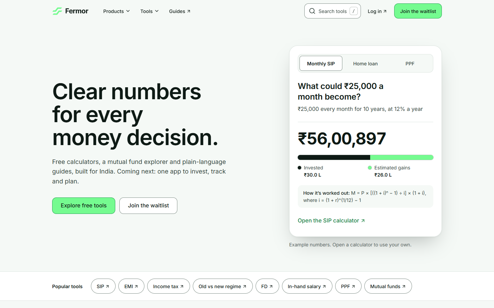
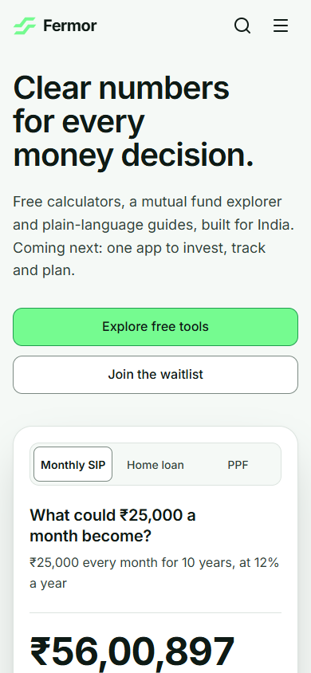

# Fermor homepage: a redesign concept

**Live site:** _[Live Demo](https://fermor-lime.vercel.app/)_






## Project structure

```
src/
  App.jsx          the page outline: providers, then the sections in order
  data/            all content and URLs (plain modules, no JSX)
  lib/             pure logic with unit tests: finance math, formatting, search, links, scrolling
  hooks/           reusable behavior: scroll, keyboard shortcuts, count-up, active section
  components/
    ui/            building blocks: Button, SmartLink, Badge, Section, Container
    layout/        header, menus, search, dialogs, footer
    sections/      one file per page section (smaller pieces in sections/parts/)
    mockups/       the phone and its four app screens
  dev/             a development-only style guide
public/            logo, favicon, social preview image
docs/screenshots/  screenshots used in this README
scripts/           font check and link check
```

## Run it on your own machine

You need [Node.js](https://nodejs.org) 22.12 or newer.

```bash
# 1. Get the code
git clone <repo-url>
cd fermor-homepage

# 2. Install dependencies
npm install

# 3. Start the development server, then open http://localhost:5173
npm run dev
```

Other commands:

```bash
npm run check      # lint, unit tests and a production build
npm run test       # unit tests only
npm run build      # production build into dist/
npm run preview    # serve the production build on http://localhost:4173
npm run links      # check that every link to fermor.in still works (needs internet)
npm run format     # format the code with Prettier
```

While `npm run dev` is running, a style guide (colors, type scale, buttons, number formats) is at `http://localhost:5173/?styleguide`.

## Decision process

**Built for professionals, not for show.** I wanted the page to feel calm and professional, because the people using it are making real money decisions. That is why there is very little animation. A short sequence in the hero, a count-up on the example result, a fade when the app screen changes, and nothing else. Fermor should impress with its product, not with an animated website.

**What exists comes first.** The page leads with what Fermor has already built: 158 calculators, the mutual fund explorer, credit card comparison and the guides. The upcoming app gets the same level of attention, with its own large section, but it comes after the tools you can use today. The page gives a feeling for what Fermor wants to be and what the product will do, while staying honest about what is live now.

**The hero shows the product working.** Instead of a slogan and a stats strip, the first thing you see is a real calculation (a SIP, a home loan or PPF) with its result, the split between what you put in and what you earn, and the formula behind it. That is Fermor's own "show the full math" idea, made visible.

**It still looks like Fermor.** I kept Fermor's logo and color family, the mint green from your buttons and logo, so the page does not look foreign to you. The layout, section order, components and copy are new. 

**Links go to your website.** I did not rebuild the calculators, the fund explorer or the guides. Every tool link opens the real page on fermor.in in a new tab, marked with ↗. App products that are not launched yet (Market, Portfolio, Ask, ACT, For Kids) open a short "coming soon" dialog instead of a dead link.

**Typography and whitespace.** One typeface throughout (Inter, the font Fermor already uses), with a clear type scale, comfortable line lengths and generous spacing between sections, so each part reads on its own. Numbers use tabular figures and Indian formatting (₹56,00,897, ₹1.65 Cr), so they line up and read naturally.

**Returning visitors get there fast.** Someone who comes back for a specific tool does not have to scroll and hunt for it. There is search in the header (press `/` or Ctrl/Cmd+K, type "emi", press Enter), a strip of popular tools right under the hero, a Tools menu, and quick links in the footer.

**Built to WCAG standards.** The whole page works with a keyboard alone: a skip link, a visible focus ring on every control, menus and dialogs that close with Escape and return focus to where you were. Colors meet WCAG AA contrast, the layout works from small phones to wide screens, and animation is switched off for people who ask their system for reduced motion.

